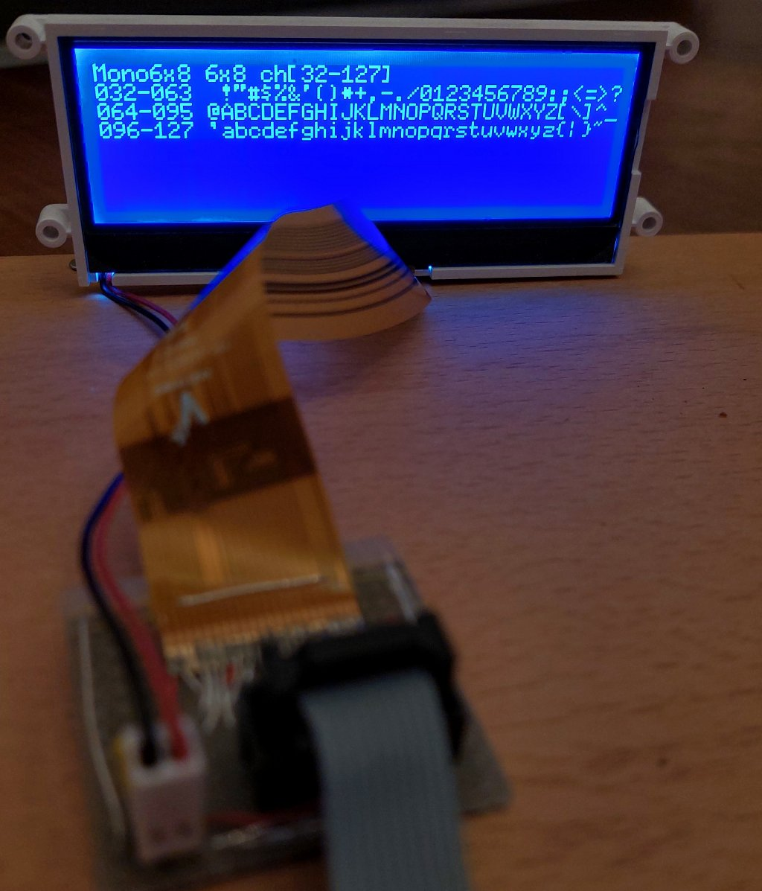
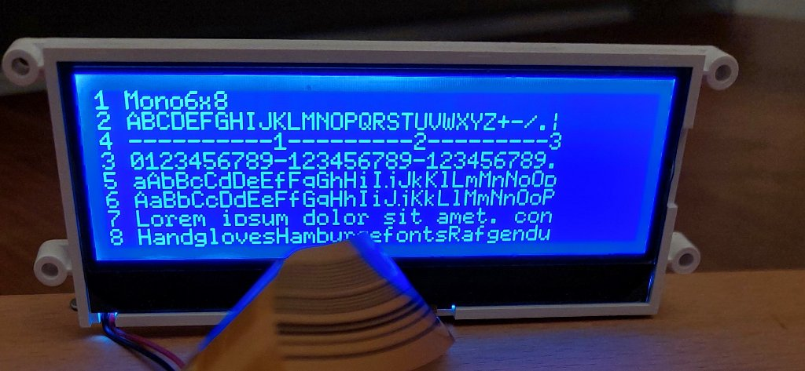
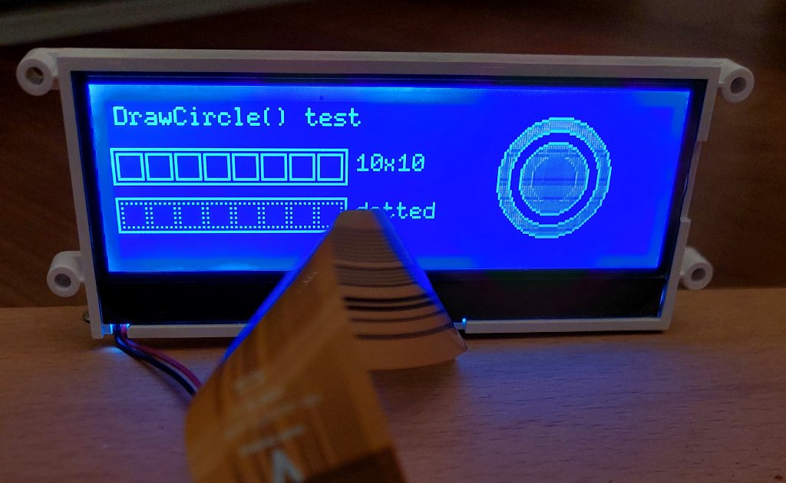
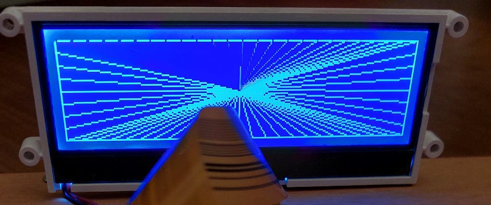

# esp32_cog_vlgem1277

Graphics library for the Varitronix COG-VLGEM1277-01 Display. 

Currently available at [pollin.de](https://www.pollin.de/p/varitronix-lcd-cog-vlgem1277-01-240x64-pixel-121713)


Some more information about how to connect to a µC can be found at [mikrocontroller.net](https://www.mikrocontroller.net/topic/472549)






# Usage

### 1) Include header file and font files
```c
#include "cog_vlgem1277_lcd.h"
#include "font_mono6x8.h"
```

### 2) Create an instance of the class with the SPI pin connected to the µC, e.g. the standard ESP32 SPI bus (5,18,23 and 17 for Address-Bit)
```c
COG_VLGEM1277 lcd(PIN_CS,PIN_SCK,PIN_MOSI,PIN_A0);
```
### 3) Call Begin() member to init SPI and the display
```c
void setup() {
  lcd.Begin();
}
```

### 4) Use the text and graphics functions e.g.
```c
lcd.DrawRect( 0,18,98,32);
lcd.DrawCircle(190,30,10,col_e::WHITE,col_e::BLACK);
lcd.SetFont(font);
lcd.SetCursor(0,0);
lcd.printf("DrawCircle() test ");
lcd.RefreshLCD();
```


# Sample main.cpp

```c
#include <Arduino.h>
#include <SPI.h>
#include "cog_vlgem1277_lcd.h"
#include "font_mono6x8.h"
#include "font_serif6x8.h"
#include "font_sans6x8.h"
#include "font_square6x8.h"

// Varitronix COG_VLGEM1277 LCD
constexpr uint8_t PIN_CS   =  5;  // PB2: CS    (LCD[/CS]: Chip-Enable, low-active)
constexpr uint8_t PIN_SCK  = 18;  // PB5: SCK   (LCD[SCL]: Serial Clock)
constexpr uint8_t PIN_MOSI = 23;  // PB3: MOSI  (LCD[SI]:  Data In)
constexpr uint8_t PIN_A0   = 17;  // PD3: A0    (LCD[A0]:  LSB of Adress Bus: 0=Commands/1=Data)

COG_VLGEM1277 lcd(PIN_CS,PIN_SCK,PIN_MOSI,PIN_A0);

// lorem ipsum...
static const char bt00[] =
  "Lorem ipsum dolor sit amet, consetetur sadipscing elitr, sed "
  "diam nonumy eirmod tempor invidunt ut labore et dolore magna "
  "aliquyam erat, sed diam voluptua. At vero eos et accusam et "
  "justo duo dolores et ea rebum.\n" 
  ;

// 8 lines of text
static const char bt01[] =
  "2 ABCDEFGHIJKLMNOPQRSTUVWXYZ+-/.|\n"
  "4 ----------1---------2---------3\n"
  "3 0123456789-123456789-123456789.\n"  
  "5 aAbBcCdDeEfFgGhHiIjJkKlLmMnNoOp\n"
  "6 AaBbCcDdEeFfGgHhIiJjKkLlMmNnOoP\n"
  "7 Lorem ipsum dolor sit amet, con\n"
  "8 HandglovesHamburgefontsRafgendu"
  ;

void test_font_alphabet(uint8_t *font, const char* font_name) {
  int16_t fnt_ch_s=lcd.GetFontStartChar();    // start char of font
  int16_t fnt_ch_e=lcd.GetFontEndChar();      // end char of font
  int16_t fnt_h=lcd.GetFontHeight();          // char height
  int16_t fnt_w=lcd.GetFontWidth();           // char width
  int16_t rc=0,ic=0,jc=0;
  lcd.ClearScreen();
  lcd.SetRefreshMode(mod_e::autoRefresh_OFF); // stop auto-refresh
  lcd.SetFont(font);
  lcd.SetCursor(0,0);
  lcd.printf("%s %dx%d ch[%d-%d]",font_name,fnt_w,fnt_h,fnt_ch_s,fnt_ch_e);
  for(rc=0,ic=fnt_ch_s;rc <= ((fnt_ch_e-fnt_ch_s)/32); rc++ ) {
    lcd.printf("\n%03d-%03d ",ic,ic+31);
    for(jc=0; jc<32 && ic<fnt_ch_e;jc++, ic++){  
      lcd.DrawChar(ic); 
    }
  }
  lcd.RefreshLCD();  // do refresh now
  delay(4000);
  lcd.SetRefreshMode(mod_e::autoRefresh_OFF);
  lcd.printf("\n1 %s\n%s",font_name,bt01);
  lcd.RefreshLCD();
  delay(10000);
}

void test_font_typewriter(uint8_t *font, const char *font_name) {
  lcd.ClearScreen();
  lcd.SetRefreshMode(mod_e::autoRefresh_ON);
  lcd.SetFont(font);
  lcd.SetCursor(0,0);
  lcd.printf("%s in typewriter mode\n\n",font_name);
  lcd.DrawString(bt00,50); // print text typewriter
  delay(4000);
}

void test_rectangle(void) {
  lcd.ClearScreen();
  lcd.SetRefreshMode(mod_e::autoRefresh_ON); // automatic refresh 
  lcd.SetFont((uint8_t *)Mono6x8); 
  lcd.SetCursor(2,2); 
  lcd.printf("DrawRect() test");
  lcd.DrawRect( 0,18,98,32);
  lcd.DrawRect( 2,20,12,30);
  lcd.DrawRect(14,20,24,30);
  lcd.DrawRect(26,20,36,30);
  lcd.DrawRect(38,20,48,30);
  lcd.DrawRect(50,20,60,30);
  lcd.DrawRect(62,20,72,30);
  lcd.DrawRect(74,20,84,30);
  lcd.DrawRect(86,20,96,30);
  lcd.SetCursor(102,20); 
  lcd.printf("10x10");
  lcd.DrawRect(  0,38,98,52,col_e::WHITE,col_e::BLACK,pat_e::solid);
  lcd.DrawRect(  2,40,12,50,col_e::WHITE,col_e::BLACK,pat_e::dotted);
  lcd.DrawRect( 14,40,24,50,col_e::WHITE,col_e::BLACK,pat_e::dotted);
  lcd.DrawRect( 26,40,36,50,col_e::WHITE,col_e::BLACK,pat_e::dotted);
  lcd.DrawRect( 38,40,48,50,col_e::WHITE,col_e::BLACK,pat_e::dotted);
  lcd.DrawRect( 50,40,60,50,col_e::WHITE,col_e::BLACK,pat_e::dotted);
  lcd.DrawRect( 62,40,72,50,col_e::WHITE,col_e::BLACK,pat_e::dotted);
  lcd.DrawRect( 74,40,84,50,col_e::WHITE,col_e::BLACK,pat_e::dotted);
  lcd.DrawRect( 86,40,96,50,col_e::WHITE,col_e::BLACK,pat_e::dotted);
  lcd.SetCursor(102,40); 
  lcd.printf("dotted");
  lcd.RefreshLCD();
  delay(2000);
  lcd.SetCursor(2,2); 
  lcd.printf("DrawCircle() test         ");
  lcd.DrawCircle(190,30,25,col_e::WHITE,col_e::GREY); delay(1000);
  lcd.DrawCircle(190,30,20);delay(1000);
  lcd.DrawCircle(190,30,15,col_e::WHITE,col_e::GREY); delay(1000);
  lcd.DrawCircle(190,30,10,col_e::WHITE,col_e::BLACK);delay(1000);
  lcd.RefreshLCD();
  delay(2000);
}

void test_lines(void) {
  lcd.ClearScreen();
  lcd.DrawRect(0,0,xMax,63);
  lcd.SetFont((uint8_t *)Mono6x8); 
  lcd.SetCursor(2,2); 
  lcd.printf("DrawLine() test");
  lcd.RefreshLCD();
  delay(1000);
  lcd.SetRefreshMode(mod_e::autoRefresh_OFF);
  lcd.DrawRect(0,0,xMax,63);
  for(uint8_t kc=0;kc<2;kc++) {
    lcd.SetRefreshMode(mod_e::autoRefresh_ON); // automatic refresh 
    for (uint8_t ic=0;ic<240;ic+=10) { lcd.DrawLine(119,31,ic,0);       }
    for (uint8_t ic=0;ic< 64;ic+= 8) { lcd.DrawLine(119,31,xMax,ic);    }
    for (uint8_t ic=0;ic<240;ic+=10) { lcd.DrawLine(119,31,xMax-ic,63); }
    for (uint8_t ic=0;ic< 64;ic+= 8) { lcd.DrawLine(119,31,0,63-ic);    }
    for (uint8_t ic=0;ic<240;ic+=10) { lcd.DrawLine(119,31, ic,0,col_e::BLACK);     }
    lcd.DrawLine(0,0,xMax,0);
    for (uint8_t ic=0;ic< 64;ic+= 8) { lcd.DrawLine(119,31,xMax,ic,col_e::BLACK);    }
    lcd.DrawLine(xMax,0,xMax,63);
    for (uint8_t ic=0;ic<240;ic+=10) { lcd.DrawLine(119,31,xMax-ic,63,col_e::BLACK); }
    lcd.DrawLine(xMax,63,0,63);
    for (uint8_t ic=0;ic< 64;ic+= 8) { lcd.DrawLine(119,31,0,63-ic,col_e::BLACK);    }
    lcd.DrawLine(0,63,0,0);
    delay(1000);
  }
}

void setup() {
  lcd.Begin();
}

void loop() {
  test_font_alphabet(  (uint8_t *)Mono6x8,  "Mono6x8");
  test_font_alphabet(  (uint8_t *)Serif6x8, "Serif6x8");
  test_font_alphabet(  (uint8_t *)Sans6x8,  "Sans6x8");
  test_font_alphabet(  (uint8_t *)Square6x8,"Square6x8");
  
  test_font_typewriter((uint8_t *)Mono6x8,  "Mono6x8" );
  test_font_typewriter((uint8_t *)Serif6x8, "Serif6x8");
  test_font_typewriter((uint8_t *)Sans6x8,  "Sans6x8");
  test_font_typewriter((uint8_t *)Square6x8,"Square6x8");
  test_rectangle();
  test_lines();
}
```